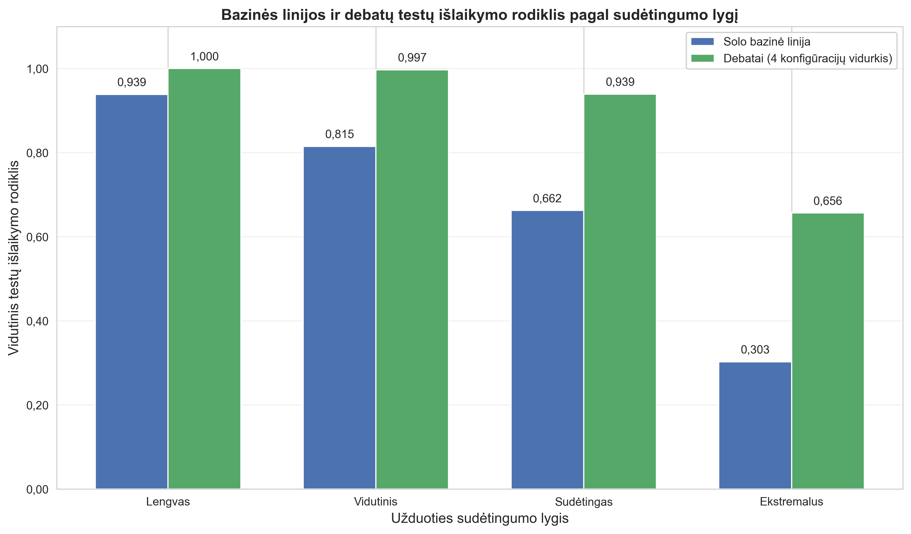
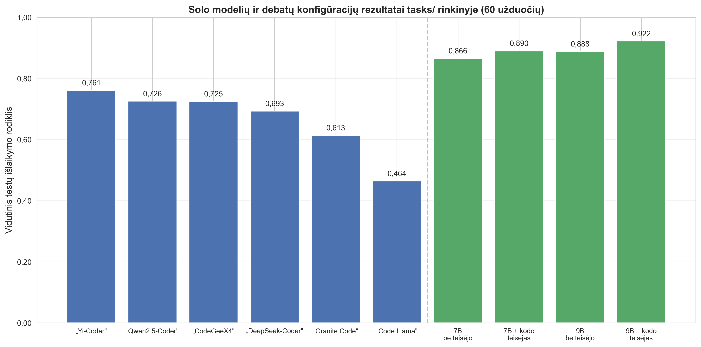
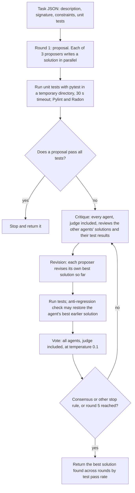
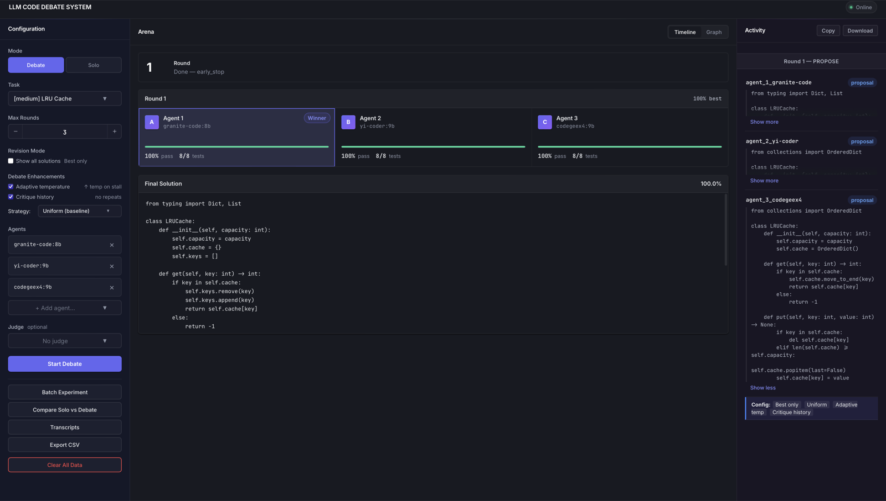
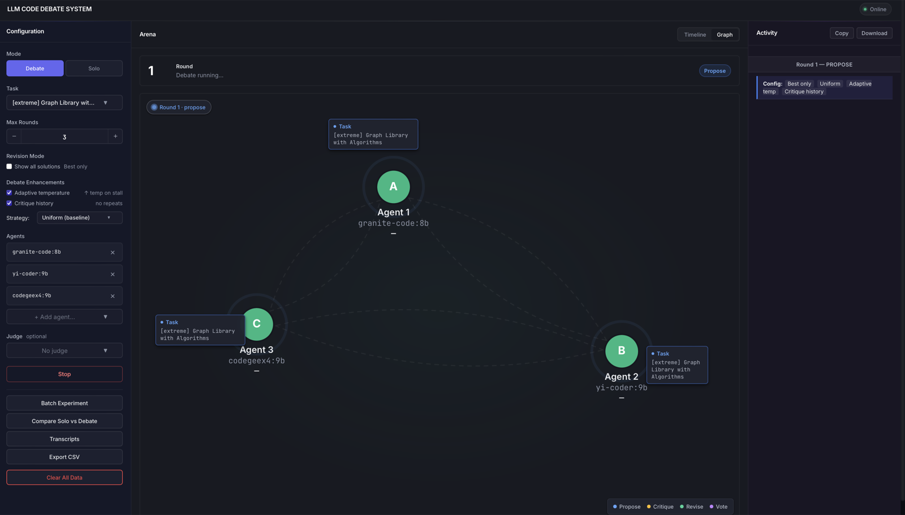

# LLM Code Debate

A multi-agent debate system for code generation in which several local open-weight LLMs, served by Ollama, propose, critique, revise and vote on solutions to programming tasks that are scored with unit tests.

[](LICENSE)
[](pyproject.toml)
[](docs/thesis/Magalinski_2026_BSc_thesis_LT.pdf)
[](https://github.com/lukamaga/llm-code-debate/actions/workflows/tests.yml)
[](https://github.com/lukamaga/llm-code-debate/actions/workflows/pylint.yml)

> **Bachelor's thesis**
>
> **The Impact of Multi-Agent Debate on the Code Generation Effectiveness of Local Large Language Models (LLMs) Across Varying Task Complexities**
> *Daugiaagentinių debatų įtaka lokalių didelių kalbos modelių (LLM) kodo generavimo efektyvumui skirtingo sudėtingumo užduotyse*
>
> Lukaš Patrik Magalinski · Supervisor: Prof. Dr. Aistis Raudys
> Vilnius University, Faculty of Mathematics and Informatics, study programme Informatics · Vilnius, 2026
>
> Full text (Lithuanian, with an English summary): [docs/thesis/Magalinski_2026_BSc_thesis_LT.pdf](docs/thesis/Magalinski_2026_BSc_thesis_LT.pdf) · Abstract: [docs/thesis/README.md](docs/thesis/README.md)

All experimental results and setup figures in this README (models, task counts, runs, hardware, settings and results) are taken from the thesis; decimal commas are written as dots and the thesis rounding is kept. Each paragraph or table names the thesis section or table it comes from. Software details (ports, CLI defaults, configuration keys) describe the code in this repository.

## Contents

- [Abstract](#abstract)
- [Key findings](#key-findings)
- [Method](#method)
- [Benchmark](#benchmark)
- [Experimental setup](#experimental-setup)
- [Results](#results)
- [Limitations](#limitations)
- [Installation](#installation)
- [Quick start](#quick-start)
- [Configuration](#configuration)
- [Reproducing the experiments](#reproducing-the-experiments)
- [Running the tests](#running-the-tests)
- [Repository structure](#repository-structure)
- [Citation](#citation)
- [License and acknowledgements](#license-and-acknowledgements)

## Abstract

Open-weight models with 7-9 billion parameters can run on local hardware, but on complex code-generation tasks they often produce incorrect or incomplete code. This work designs, implements and evaluates a modular four-phase multi-agent debate system (proposal, critique, revision, vote) for such models. The system includes an anti-regression policy, adaptive temperature, critique history, chunked generation for multi-file tasks and limited solution visibility suited to the small context of these models. A custom benchmark of 90 unique tasks across four difficulty levels was built, including 40 multi-file extreme-level tasks designed for this work. Eleven SLURM jobs on the VU MIF high-performance computing cluster produced 960 run records (600 debates and 360 solo runs); four further jobs produced 240 runs with adaptive temperature switched off, for 15 jobs and 1200 run records in total (thesis §3.1). Over 120 task-set pairs, the mean test pass rate of four debate configurations was 0.824, versus 0.551 for the baseline (independent solo runs on `tasks/`, the debates' round-1 proposals on `tasks2/`) (+27.3 percentage points; 108 wins, 12 ties, 0 losses), and the gain grew with difficulty from +6.1 pp on easy to +35.3 pp on extreme tasks (thesis §4.2). The 9B proposer pool was not better than the 7B pool, and adding a judge model did not raise the pass rate (§4.3-4.4). A reasoning judge added 55-58% run time, and static code quality (Pylint, Radon) changed little (§4.7). Because the system returns the best solution found across rounds by unit-test pass rate, the final pass rate was never below the best first-round proposal in any of the 600 debates (§4.2).

## Key findings

1. **Debate vs single-model baseline** (thesis §4.2, Tables 6-7). On the 60 tasks of `tasks/`, the four debate configurations reached a mean test pass rate of **0.891**, versus **0.664** for the six solo models (+22.7 pp; 49 wins, 11 ties, 0 losses). On the 60 hard and extreme tasks of `tasks2/`, the debate mean was **0.758**, versus **0.439** for the mean of the debates' own round-1 proposals (+31.9 pp; 59/1/0). Over all 120 task-set pairs: **0.824 vs 0.551, +27.3 pp, 108/12/0.**
2. **The gain grows with difficulty** (Table 8): +6.1 pp (easy), +18.2 pp (medium), +27.7 pp (hard), +35.3 pp (extreme). The share of fully solved tasks (all tests pass) rose from 49.7% to 72.1% on `tasks/` and from 17.2% to 40.0% on `tasks2/` (§4.2; per-difficulty values in Table 9).
3. **Final result vs the best first-round proposal** (Table 11). Over all 600 debates the final pass rate was higher than the best round-1 proposal in 113 runs (18.8%), equal in 487 (81.2%) and lower in 0. This follows from the anti-regression policy, which returns the best solution found across rounds; the thesis states this itself (§4.2).
4. **Recovery from runs without a fully passing candidate** (§4.2). In 282 debates no candidate solution in any round passed all unit tests (CSV field `pass_at_3 = 0`); in 254 of them (90.1%) the final solution still passed at least one test. The thesis text describes this group as cases with a zero first-round result (R1_max = 0); the definition above is the one used to compute the counts (see [docs/RESULTS.md](docs/RESULTS.md#42-debate-vs-baseline)).
5. **Pool size** (§4.3, Tables 12-13). The 9B pool was not better than the 7B pool: combined differences were at most 1 pp, and none of the four paired t-tests reached p < 0.05.
6. **Judge models** (§4.4, Table 15). Adding a judge did not raise the pass rate. For Pool A the three judge modes were within 0.5 pp of each other; for Pool B the means were 0.761 (no judge), 0.722 (code judge) and 0.762 (reasoning judge). Each configuration was run once.
7. **Cost** (§4.7, Tables 17 and 22). A debate took 123-315 s on average, versus 7.9 s for a solo run (about 15-40× longer). On `tasks2/` the reasoning judge added +55.1% (Pool A) and +58.2% (Pool B) run time, the code judge +14.4% and +16.0%.

A post-hoc re-analysis with stricter definitions (task-level statistics, separation of selection and debate effects) is available in [docs/RESULTS.md](docs/RESULTS.md#post-hoc-re-analysis-october-2026).

<p align="center">
  
  <br>
  <em><b>Thesis Fig. 9.</b> Mean test pass rate of the baseline (blue) and of debate (green, mean of 4 configurations) by difficulty level, as in thesis Table 8. Labels are in Lithuanian (Lengvas = easy, Vidutinis = medium, Sudėtingas = hard, Ekstremalus = extreme). The legend reads "solo baseline", but for hard and extreme tasks the baseline combines the solo mean on <code>tasks/</code> with the round-1 mean on <code>tasks2/</code>.</em>
</p>

<p align="center">
  
  <br>
  <em><b>Thesis Fig. 6.</b> Mean test pass rate of the six solo models (blue) and the four debate configurations (green) on the 60 tasks of <code>tasks/</code> (thesis Tables 5-6). "be teisėjo" = no judge, "+ kodo teisėjas" = + code judge.</em>
</p>

## Method

The debate loop is implemented in `DebateOrchestrator` (`src/core/orchestrator.py`) and described in thesis chapter 2. The same orchestrator is used by the command-line interface, the web interface and the HPC batch scripts (§2.1).



**Roles** (§2.2, §2.2.7).
- Three **proposers** (three different models) write, critique, revise and vote.
- An optional **judge** (a larger 14-16B model) only critiques and votes; it never proposes or revises.

**Rounds** (§2.2.1). Round 1 is the proposal round. Each later round runs critique, revision and vote. The maximum is 5 rounds and the minimum is 2. Within each phase all agents are queried in parallel (`asyncio.gather`, §2.2.6). If a round-1 proposal already passes all tests, the debate stops (§2.3.4).

**What the agents see.**
- The system uses three visibility levels (§2.2.6). In critique and voting each agent sees all other agents' solutions; in revision each proposer sees its own solution and only the best other solution by test pass rate ("best-only" mode, `revision_show_all_solutions = False`, §2.2.4).
- **Test results are shown to the agents.** Critique and revision prompts list each unit test by name as PASSED or FAILED, and the voting prompt shows each solution's test pass rate (§2.3.1, §2.5.2; `src/core/prompts.py`). Critics must ground each reported bug in a failing test name or a code line (§2.6.2).

**Voting and consensus** (§2.3; `src/core/consensus.py`).
- Each vote has the fields VOTE, CONFIDENCE (0.0-1.0) and REASONING and is weighted by its confidence. Votes for one's own solution are rewritten to ABSTAIN (§2.3.1).
- A solution that passes all tests gets ×1.5 vote weight, and up to ×1.2 for its Pylint score (§2.3.2).
- Consensus requires that the leading solution holds at least 60% of the weighted vote, has at least 2 votes and passes at least 50% of the unit tests (§2.3.3).

**Control mechanisms** (§2.4).
- **Anti-regression** (§2.4.1-2.4.2). Each proposer revises its own best solution so far. A revision that loses more than one test or is syntactically broken is replaced by the agent's best earlier solution; revisions that look truncated or look like an unimplemented skeleton are also replaced when they lose tests or do not improve. **The final answer is the best solution found across all rounds, ranked by pass rate on the same unit tests that are used for scoring** (`src/core/orchestrator.py`).
- **Adaptive temperature** (§2.4.3). The revision temperature starts at 0.4 and rises by 0.15 for each round without improvement, up to 0.9.
- **Critique history** (§2.4.3). A summary of the previous round's critiques (first 3 bugs per critic, each cut to 60 characters) is added to the next prompts.
- **Revision strategy** (§2.4.4). `uniform` (all agents get the same revision prompt) was used in all experiments; a `diverse` mode exists but was not evaluated.

**Multi-file tasks** (§2.5). Extreme tasks list the files to produce in `required_files`. Each file is generated with a separate model call that sees the files already written ("chunked" generation).

**Execution** (§2.7). Each solution runs in a fresh temporary directory, in a separate pytest subprocess with a 30 s timeout. This is process isolation, not a security sandbox: no memory or network limits are enforced. Results are cached by code and tests.

**Storage** (§2.9). Every run is stored in SQLite via SQLAlchemy. `python -m src.analysis.csv_export` writes a 44-column summary CSV and a 17-column per-round CSV.

<p align="center">
  
  <br><em>Web interface, Timeline view (thesis Appendix, screenshot 1). The web interface was used for preliminary tuning runs (§3.4.1).</em>
</p>

## Benchmark

Two task sets with 90 unique tasks in total (thesis §3.3, Table 4).

| Difficulty | `tasks/` | `tasks2/` | Unique | Source |
|---|---|---|---|---|
| Easy | 15 | 0 | 15 | LeetCode Easy (12) + classic exercises (3) |
| Medium | 15 | 0 | 15 | LeetCode Medium (15) |
| Hard | 15 | 20 | 20 | LeetCode Hard (17) + algorithm textbooks (3) |
| Extreme | 15 | 40 | 40 | multi-file tasks designed for this work (40) |
| **Total** | **60** | **60** | **90** | |

- The 15 hard and 15 extreme tasks of `tasks/` also appear in `tasks2/hard` (15 of 20) and `tasks2/extreme` (15 of 40), so 30 tasks of `tasks2/` overlap with `tasks/` and 30 are new.
- Task descriptions were rewritten and all unit tests were written for this work (§3.3).
- Every extreme task needs two or three Python modules with cross-module imports (§3.3).
- Tests per task file range from 4 to 16, with a mean of 8.91 over the 120 task files of both sets (§2.7.4, §3.3).

**Task format.** Each task is a JSON file with `id`, `name`, `difficulty`, `description`, `signature`, `tests` (a list of pytest functions as source strings) and `constraints`. Extreme tasks add `required_files`, `test_imports` and `tags` (§3.3). Example, shortened from `tasks/easy/two_sum.json`:

```json
{
  "id": "two_sum",
  "name": "Two Sum",
  "difficulty": "easy",
  "description": "Given an array of integers nums and an integer target, return indices of the two numbers such that they add up to target...",
  "signature": "def two_sum(nums: list[int], target: int) -> list[int]:",
  "tests": [
    "def test_basic():\n    assert sorted(two_sum([2, 7, 11, 15], 9)) == [0, 1]"
  ],
  "constraints": ["2 <= nums.length <= 10^4", "Only one valid answer exists"]
}
```

For single-file tasks the solution is written to `solution.py` and its public names are made available to the tests. For multi-file tasks each generated file keeps its own name and the test file starts with the `test_imports` lines (`src/core/executor.py`).

**Adding a task.**
1. Create `tasks/<difficulty>/<id>.json` (or any folder; the CLI accepts any path, the web interface lists only `tasks/`).
2. Check the tests against a reference solution, for example with the helpers `run_single_file` / `run_multi_file` in `scripts/validate_tasks2.py`.
3. `python scripts/run_validate.py all` runs the reference solutions in `scripts/refs_*.py` against the 30 tasks that are new in `tasks2/`.

## Experimental setup

**Models** (thesis §3.2, Table 3). Context as listed in thesis Table 3 (1K = 1024 tokens); every request is sent with `num_ctx = 32768` (§2.1.4).

| Role | Model | Ollama tag | Parameters | Context |
|---|---|---|---|---|
| Proposer, Pool A (7B) | Qwen2.5-Coder | `qwen2.5-coder:7b` | 7B | 32K |
| Proposer, Pool A (7B) | DeepSeek-Coder | `deepseek-coder:6.7b` | 6.7B | 16K |
| Proposer, Pool A (7B) | Code Llama | `codellama:7b-instruct` | 7B | 16K |
| Proposer, Pool B (9B) | Granite Code | `granite-code:8b` | 8B | 128K |
| Proposer, Pool B (9B) | CodeGeeX4 | `codegeex4:9b` | 9B | 128K |
| Proposer, Pool B (9B) | Yi-Coder | `yi-coder:9b` | 9B | 128K |
| Judge (code-specialised) | DeepSeek-Coder-V2-Lite | `deepseek-coder-v2:16b` | 16B total / 2.4B active | 128K |
| Judge (reasoning) | DeepSeek-R1-Distill-Qwen-14B | `deepseek-r1:14b` | 14B, distilled | 128K |

**Runs** (§3.1, Table 2).

| Experiment tag | Pool | Judge | Task set | Records |
|---|---|---|---|---|
| `7b_no_judge` / `7b_judge` | A | none / DeepSeek-Coder-V2 | `tasks/` (60) | 60 / 60 |
| `9b_no_judge` / `9b_judge` | B | none / DeepSeek-Coder-V2 | `tasks/` (60) | 60 / 60 |
| `7b_no_judge2` / `7b_judge2` / `7b_judge2_r1` | A | none / DeepSeek-Coder-V2 / DeepSeek-R1 | `tasks2/` (60) | 60 each |
| `9b_no_judge2` / `9b_judge2` / `9b_judge2_r1` | B | none / DeepSeek-Coder-V2 / DeepSeek-R1 | `tasks2/` (60) | 60 each |
| `all6_solo` | 6 models, one at a time | none | `tasks/` (60) | 360 |

- **Main stage:** 11 SLURM jobs (10 debate configurations + 1 solo job), 960 unique run records (600 debates + 360 solo runs).
- **Adaptive-temperature ablation:** the four `tasks2/` configurations without a judge or with the code judge were re-run with adaptive temperature off, giving 240 OFF records paired with the corresponding ON runs (§3.1, §4.5).
- **Total:** 15 SLURM jobs and 1200 unique run records. Each configuration-task pair was run once (§4.8).
- **Baselines** (§4.2). On `tasks/` the baseline is the mean of the six solo models. `tasks2/` has no solo runs, so its baseline is the mean of the debates' round-1 proposals.

**Fixed settings in all main debate runs** (§3.1): at most 5 and at least 2 rounds; consensus at 60% of the vote weight plus at least 50% of tests passed; adaptive temperature and critique history on (`--adaptive-temperature --critique-history`); best-only visibility; `revision_strategy = uniform`.

**Hardware** (§3.4.2). VU MIF HPC cluster, SLURM with Singularity. Each job used one NVIDIA V100 32 GB GPU, 5 CPU cores, 60 GB RAM and a 6-hour limit (8 hours for the solo job). Ollama ran with `OLLAMA_FLASH_ATTENTION=1` and `OLLAMA_MAX_LOADED_MODELS=5` (§2.1.5). The estimated GPU memory need was about 26-29 GB; no out-of-memory errors occurred.

**Metrics** (§3.5). The main metric is `final_pass_rate`, the share of a task's unit tests passed by the final solution, averaged over tasks. A task is "fully solved" when all tests pass. Further metrics include pass@k, `peak_after_debate`, consensus rate, run time, Pylint score and Radon cyclomatic complexity; see [docs/RESULTS.md](docs/RESULTS.md#metric-definitions).

## Results

Mean final test pass rate per configuration (thesis Table 6):

| Configuration | `tasks/` (60) | `tasks2/` (60) | Combined (120 pairs) |
|---|---|---|---|
| Baseline (solo / R1) | 0.664 | 0.439 | 0.551 |
| Debate: Pool A (7B), no judge | 0.866 | 0.776 | 0.821 |
| Debate: Pool A (7B) + code judge | 0.890 | 0.771 | 0.830 |
| Debate: Pool B (9B), no judge | 0.888 | 0.761 | 0.824 |
| Debate: Pool B (9B) + code judge | 0.922 | 0.722 | 0.822 |
| Debate mean (4 configurations) | 0.891 | 0.758 | 0.824 |
| Δ (debate − baseline) | +22.7 pp | +31.9 pp | +27.3 pp |

By difficulty, `tasks/` and `tasks2/` combined, mean of the 4 debate configurations (Table 8), with the share of fully solved tasks (Table 9):

| Difficulty | Baseline | Debate | Δ (pp) | Fully solved, `tasks/`: solo → debate | Fully solved, `tasks2/`: R1 → debate |
|---|---|---|---|---|---|
| Easy | 0.939 | 1.000 | +6.1 | 90.0% → 100.0% | n/a |
| Medium | 0.815 | 0.997 | +18.2 | 68.9% → 98.3% | n/a |
| Hard | 0.662 | 0.939 | +27.7 | 32.2% → 68.3% | 40.8% → 73.8% |
| Extreme | 0.303 | 0.656 | +35.3 | 7.8% → 21.7% | 5.4% → 23.1% |

Judge modes on `tasks2/`, 60 tasks per configuration (Tables 15 and 17):

| Configuration | Pass rate | Hard (20) | Extreme (40) | Mean duration (s) |
|---|---|---|---|---|
| Pool A, no judge | 0.776 | 0.970 | 0.679 | 203.1 |
| Pool A + code judge | 0.771 | 0.947 | 0.683 | 232.4 |
| Pool A + reasoning judge | 0.771 | 0.966 | 0.674 | 314.9 |
| Pool B, no judge | 0.761 | 0.966 | 0.658 | 169.9 |
| Pool B + code judge | 0.722 | 0.919 | 0.624 | 197.2 |
| Pool B + reasoning judge | 0.762 | 0.950 | 0.667 | 268.8 |

**Adaptive-temperature ablation** (§4.5, Table 20). Over 240 ON/OFF pairs on `tasks2/`, the mean pass rate was 0.758 with adaptive temperature and 0.718 without (+3.99 pp; 76 wins, 116 ties, 48 losses; paired t = +2.60, p = 0.010; Wilcoxon p = 0.012). Per configuration the differences were +1.1 to +7.3 pp, none significant after Bonferroni correction. Each arm is a single run per task.

**Static code quality** (§4.7, Table 23). After the debate the Pylint score was 0.06-0.40 points lower than the mean of the round-1 proposals, and the Radon cyclomatic complexity changed by at most 0.14 (Table 23; the thesis text rounds this to "does not exceed 0.15").

All thesis tables (solo models, best single model, pools, peak-after-debate, rounds, correlations, cost by difficulty, static quality) and the metric definitions are in **[docs/RESULTS.md](docs/RESULTS.md)**.

## Limitations

From the thesis (§3.3, §4.2, §4.8):
- **One run per configuration and task**, with no repeated seeds. Paired tests use tasks as pairs, so they do not measure run-to-run variation.
- **Custom benchmark.** `tasks2/` is not a public benchmark, so absolute values are not comparable with HumanEval or MBPP. The easy, medium and hard tasks resemble LeetCode problems and may appear in the models' training data.
- **Scope.** Only open-weight 7-9B models running locally, and only Python.
- **Different baselines.** The `tasks2/` baseline is the round-1 mean of the debates, not separate solo runs. The 120 combined pairs are task-set pairs, not 120 unique tasks (30 tasks occur in both sets).
- **No regressions by design.** The "final ≥ best round-1 proposal" result reflects this system's anti-regression policy.

Design notes for interpreting the numbers:
- **Selection by test pass rate.** The reported final solution is the best candidate across all rounds on the same unit tests that are used for scoring, and agents see per-test PASSED/FAILED results during the debate. There is no hidden test set.
- **Correlations are not causal** (§4.5). The field `total_bugs_fixed`, which the thesis calls "bugs fixed", counts additionally passed tests between round 1 and the last round, so it is measured with the same tests as the improvement it is correlated with.

## Installation

Requirements: Python 3.11 or newer (the thesis system used Python 3.11) and a running [Ollama](https://ollama.com) server on `http://localhost:11434`.

```bash
git clone https://github.com/lukamaga/llm-code-debate.git
cd llm-code-debate
python3 -m venv venv
source venv/bin/activate
pip install -r requirements.txt
```

Alternatively, `pip install -e .` installs the runtime dependencies from `pyproject.toml` and adds the `llm-debate` command (same options as `python -m src.main`). `requirements.txt` additionally contains the analysis, plotting and type-checking packages.

Pull the models used in the experiments with their exact tags:

```bash
ollama pull qwen2.5-coder:7b
ollama pull deepseek-coder:6.7b
ollama pull codellama:7b-instruct
ollama pull granite-code:8b
ollama pull codegeex4:9b
ollama pull yi-coder:9b
ollama pull deepseek-coder-v2:16b   # code judge
ollama pull deepseek-r1:14b         # reasoning judge
```

## Quick start

Run from the repository root with Ollama running. The examples write to a separate `runs/` folder so that `results/` keeps only the thesis exports.

```bash
mkdir -p runs

# Solo baseline: one model, one attempt
python -m src.main --task tasks/easy/two_sum.json --agents qwen2.5-coder:7b --solo --output runs/

# Debate with the settings of the thesis runs (Pool A, no judge)
python -m src.main --task tasks/medium/lru_cache.json \
  --agents qwen2.5-coder:7b deepseek-coder:6.7b codellama:7b-instruct \
  --max-rounds 5 --adaptive-temperature --critique-history --output runs/

# Same pool with the code-specialised judge
python -m src.main --task tasks/hard/word_ladder.json \
  --agents qwen2.5-coder:7b deepseek-coder:6.7b codellama:7b-instruct \
  --judge deepseek-coder-v2:16b \
  --max-rounds 5 --adaptive-temperature --critique-history --output runs/
```

Main CLI options (`python -m src.main --help`):

| Option | Default | Meaning |
|---|---|---|
| `--task PATH` | None | Task JSON file |
| `--agents M1 M2 ...` | `qwen2.5-coder:7b deepseek-coder:6.7b codellama:7b-instruct` | Proposer models |
| `--judge M` | none | Optional judge (critiques and votes only) |
| `--max-rounds N` | 5 | Maximum number of rounds |
| `--adaptive-temperature` | off | Adaptive revision temperature (§2.4.3) |
| `--critique-history` | off | Previous-round critique summary in prompts (§2.4.3) |
| `--revision-strategy {uniform,diverse}` | `uniform` | Revision prompt strategy (§2.4.4) |
| `--show-all-solutions` | off | Show all other solutions in revision instead of the best one |
| `--solo` | off | Single-agent run with the first `--agents` model |
| `--output DIR` | None | Writes `<debate_id>_result.json` to DIR (created if needed) and a transcript to `DIR/transcripts/`; the transcript is skipped with a warning if DIR did not exist before the run. Without `--output`, transcripts go to `transcripts/` |
| `--config PATH` | `config.yaml` | Configuration file |
| `--web` | off | Start the web interface |

Every run is also stored in the SQLite file named by `database.path` (default `debate_results.db` in the current directory). The repository tracks a small `debate_results.db` with local development runs; to keep it unchanged, point `database.path` to another file in a copy of `config.yaml` and pass it with `--config`.

**Web interface** (thesis §2.8):

```bash
python -m src.main --web        # host and port from config.yaml: http://localhost:5050
```

The interface provides debate and solo runs, batch experiments, solo-vs-debate comparison, transcripts and CSV export, with a Timeline and a Graph view of the debate. It must be started from an interactive terminal, because Flask-SocketIO refuses to run its development server otherwise. It lists the tasks in `tasks/` and connects to Ollama at `http://localhost:11434`.

<p align="center">
  
  <br><em>Web interface, Graph view (thesis Appendix, screenshot 2).</em>
</p>

**Docker** (convenience setup, not used for the thesis experiments). The image serves the web interface on port 5050 and expects Ollama at `localhost:11434` inside the container, so on Linux run it with host networking and a terminal:

```bash
docker build -t llm-code-debate .
docker run -it --rm --network host llm-code-debate
```

With Docker Compose, Ollama and the web interface run in two containers that share one network namespace, so the application reaches Ollama at `localhost:11434`. The Ollama service reserves an NVIDIA GPU, which requires the NVIDIA Container Toolkit:

```bash
docker compose up -d --build
docker exec debate-ollama ollama pull qwen2.5-coder:7b   # repeat for each model
```

The web interface is then at `http://localhost:5050`. Compose mounts `tasks/`, `results/` and `debate_results.db` from the repository into the container.

## Configuration

`config.yaml` holds the defaults. The keys that the code reads:

| Key | Value | Meaning |
|---|---|---|
| `ollama.base_url` | `http://localhost:11434` | Ollama server used by the CLI |
| `ollama.timeout` | 120 | Per-request timeout in seconds |
| `debate.consensus_threshold` | 0.6 | Share of weighted votes needed for consensus (§2.3.3) |
| `debate.early_stop_on_perfect` | true | Stop after round 1 if a proposal passes all tests (§2.3.4) |
| `debate.max_rounds` | 5 | Overridden by `--max-rounds` (default 5) |
| `database.path` | `debate_results.db` | SQLite file for all runs (CLI) |
| `web.host`, `web.port`, `web.debug` | `0.0.0.0`, 5050, false | Web server settings for `--web` |

Optional keys `debate.adaptive_temperature`, `debate.critique_history`, `debate.revision_strategy` and `debate.revision_show_all_solutions` are combined with the corresponding CLI flags. The `agents`, `execution`, `logging` and `metrics` sections and some `debate` keys (`min_rounds`, temperatures) are not read; the values in code apply (minimum 2 rounds, revision temperature 0.4, vote temperature 0.1, execution timeout 30 s). The experiment settings are defined by the HPC scripts, not by `config.yaml`.

## Reproducing the experiments

The thesis runs were executed on the VU MIF HPC cluster with the scripts in `hpc/`. Each wrapper sets the proposer pool, judge, experiment tag, extra flags and task folders, then sources `hpc/_lib_run.sh` (the solo job `hpc/run_all6_solo.sh` is self-contained and loops over the six models with `--solo`), which starts Ollama from a Singularity image, pulls the models, runs `python3 -m src.main` once per task file with `--max-rounds 5`, and exports the CSVs (thesis §3.4.2).

| Script | Experiment tag | Pool | Judge | Tasks | Flags |
|---|---|---|---|---|---|
| `hpc/run_7b_no_judge.sh` | `7b_no_judge` | A | None | `tasks/` | `--adaptive-temperature --critique-history` |
| `hpc/run_7b_judge.sh` | `7b_judge` | A | `deepseek-coder-v2:16b` | `tasks/` | same |
| `hpc/run_9b_no_judge.sh` | `9b_no_judge` | B | None | `tasks/` | same |
| `hpc/run_9b_judge.sh` | `9b_judge` | B | `deepseek-coder-v2:16b` | `tasks/` | same |
| `hpc/run_all6_solo.sh` | `all6_solo` | 6 models | None | `tasks/` | `--solo` |
| `hpc/run_7b_no_judge2.sh` | `7b_no_judge2` | A | None | `tasks2/` | `--adaptive-temperature --critique-history` |
| `hpc/run_7b_judge2.sh` | `7b_judge2` | A | `deepseek-coder-v2:16b` | `tasks2/` | same |
| `hpc/run_9b_no_judge2.sh` | `9b_no_judge2` | B | None | `tasks2/` | same |
| `hpc/run_9b_judge2.sh` | `9b_judge2` | B | `deepseek-coder-v2:16b` | `tasks2/` | same |
| `hpc/run_7b_judge2_r1.sh` | `7b_judge2_r1` | A | `deepseek-r1:14b` | `tasks2/` | same |
| `hpc/run_9b_judge2_r1.sh` | `9b_judge2_r1` | B | `deepseek-r1:14b` | `tasks2/` | same |
| `hpc/run_*_no_adaptive_temp.sh` (4 scripts) | `*_no_adaptive_temp` | A / B | None / `deepseek-coder-v2:16b` | `tasks2/` | `--critique-history` |

On the cluster: copy the repository to `/scratch/lustre/home/$USER/llm-code-debate` (the path is set in the scripts), pull the Ollama image once (`cd hpc && singularity pull ollama_latest.sif docker://ollama/ollama`), then submit from the project root, one job at a time, since all jobs write to the same SQLite file. SLURM does not create the `logs/` directory used by `#SBATCH --output`, so create it first:

```bash
mkdir -p logs && sbatch hpc/run_7b_no_judge.sh
```

To run one configuration locally, loop over the task files with the same flags. Here the runs go to a separate database, set as `database.path: local_runs.db` in a copy of `config.yaml` named `my_config.yaml`:

```bash
mkdir -p runs
for f in tasks2/hard/*.json tasks2/extreme/*.json; do
  python -m src.main --task "$f" \
    --agents granite-code:8b codegeex4:9b yi-coder:9b \
    --judge deepseek-coder-v2:16b \
    --max-rounds 5 --adaptive-temperature --critique-history \
    --config my_config.yaml --output runs/
done
python -m src.analysis.csv_export --db local_runs.db \
  --out runs/summary_local.csv --out-rounds runs/per_round_local.csv
```

Runs are not seeded, so repeated runs give different results.

**Data.**
- `results/` contains the summary and per-round CSV exports of all 15 SLURM jobs. Each file is a cumulative export of the whole database at the end of its job (the 11 main-stage exports total 6,060 rows, thesis §3.1); the last file, `summary_9b_judge2_no_adaptive_temp_232581.csv`, contains all 1200 run records. See [results/README.md](results/README.md) for the file-to-configuration map, the column dictionary and known caveats.
- The full SQLite database of the HPC runs (`debate_results_hpc_v3.db`, about 216 MB, with complete debate transcripts) is not in this repository. It is available from the author on request.
- `transcripts/` holds human-readable transcripts of local and web-interface runs from the preliminary phase; none of them is from the HPC runs. The tracked `debate_results.db` contains local development runs, not the thesis data.

## Running the tests

```bash
python -m pytest
```

The unit tests use a mock LLM client and need neither Ollama nor network access.

## Repository structure

```
llm-code-debate/
├── src/
│   ├── main.py              # CLI entry point (python -m src.main)
│   ├── core/                # debate orchestrator, consensus, code execution, prompts
│   ├── llm/                 # async Ollama client
│   ├── models/              # dataclasses: tasks, solutions, critiques, debates
│   ├── database/            # SQLAlchemy models and repository (SQLite)
│   ├── analysis/            # metrics, transcripts, CSV export
│   └── web/                 # Flask + Flask-SocketIO web interface
├── tasks/                   # task set 1: 60 tasks (easy, medium, hard, extreme)
├── tasks2/                  # task set 2: 60 tasks (hard, extreme)
├── hpc/                     # SLURM job scripts for the VU MIF HPC cluster
├── scripts/                 # task validation, reference solutions, helpers
├── tests/                   # unit tests (pytest)
├── results/                 # CSV exports of the 15 HPC jobs
├── transcripts/             # transcripts of local / web-interface runs
├── docs/
│   ├── RESULTS.md           # all thesis result tables + post-hoc re-analysis
│   ├── images/              # figures used in the documentation
│   └── thesis/              # thesis PDF (Lithuanian) and English abstract
├── config.yaml              # default configuration
├── debate_results.db        # small local database (development runs)
├── validate_tests.py        # older reference solutions for the tasks/ hard and extreme sets (see scripts/refs_*.py for the maintained ones)
├── requirements.txt, pyproject.toml, Dockerfile, docker-compose.yml, setup.sh
├── CITATION.cff
└── LICENSE
```

The thesis reports a code base of about 27 thousand lines in total (§2.1, Conclusion 2). Later commits removed most comments and docstrings, so line counts of the current tree are lower.

## Citation

If you use this code or data, please cite the thesis (classic BibTeX; `@mastersthesis` with `type` set to Bachelor's thesis):

```bibtex
@mastersthesis{magalinski2026debate,
  author      = {Magalinski, Luka{\v{s}} Patrik},
  title       = {The Impact of Multi-Agent Debate on the Code Generation Effectiveness of Local Large Language Models ({LLMs}) Across Varying Task Complexities},
  type        = {Bachelor's thesis},
  school      = {Vilnius University, Faculty of Mathematics and Informatics},
  address     = {Vilnius, Lithuania},
  year        = {2026},
  note        = {In Lithuanian, with an English summary},
  url         = {https://github.com/lukamaga/llm-code-debate}
}
```

Citation metadata is also provided in [CITATION.cff](CITATION.cff).

## License and acknowledgements

Released under the MIT License; see [LICENSE](LICENSE).

I thank my supervisor, Prof. Dr. Aistis Raudys, and the Vilnius University Faculty of Mathematics and Informatics for access to the VU MIF high-performance computing cluster, on which all experiments were run.

---

*Note: If you find any in-code comments or docstrings, please note that they were drafted with the help of an AI assistant for readability and ease of navigation; the system, design, experiments and analysis are the author's own work.*
