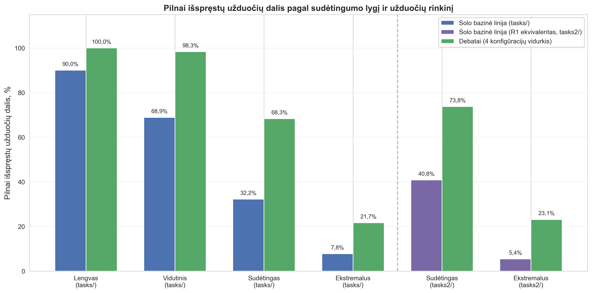
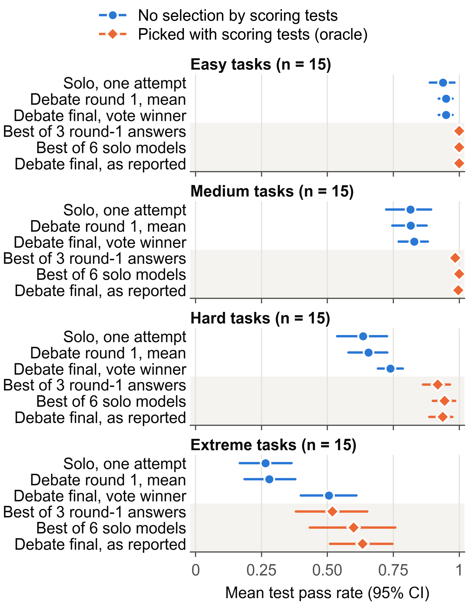

# Results

This document has two parts.

- **[Part 1. Results reported in the thesis](#part-1-results-reported-in-the-thesis)** reproduces the result tables of the thesis (chapter 4) with the thesis numbers. Decimal commas are written as dots and the thesis rounding is kept. Every table names its thesis section and table number. Where a thesis label is imprecise, the number is kept and the exact operational definition from the code is added.
- **[Part 2. Post-hoc re-analysis (October 2026)](#post-hoc-re-analysis-october-2026)** is a later re-analysis of the same data with task-level statistics. It is clearly separated from the thesis results and ends with a list of clarifications to the thesis.

The thesis PDF (Lithuanian, with an English summary) is in [thesis/Magalinski_2026_BSc_thesis_LT.pdf](thesis/Magalinski_2026_BSc_thesis_LT.pdf).

---

## Part 1. Results reported in the thesis

### Data and design (thesis §3.1–3.4)

- **Main stage:** 11 SLURM jobs (10 debate configurations + 1 solo job covering 6 models), 960 unique run records: 600 debates and 360 solo runs, on 90 unique tasks (thesis §3.1, Tables 2 and 4).
- **Adaptive-temperature ablation:** 4 further SLURM jobs re-ran the four `tasks2/` configurations without a judge or with the code judge with adaptive temperature off: 240 OFF records, paired with the corresponding ON runs of the main stage.
- **Total:** 15 SLURM jobs and 1200 unique run records. Each configuration–task pair was run once (§4.8).
- **Task sets:** `tasks/` has 60 tasks (15 easy, 15 medium, 15 hard, 15 extreme); `tasks2/` has 60 tasks (20 hard, 40 extreme). 30 tasks occur in both sets and 30 are new (§3.3, Table 4).
- **Baselines** (§4.2): on `tasks/`, the mean of the independent solo runs of the six proposer models; on `tasks2/`, which has no solo runs, the mean of the debates' round-1 (R1) proposals. Combined figures are over **120 task-set pairs** (60 + 60), not 120 unique tasks.

Configurations used in the tables:

| Name in tables | Proposers | Judge |
|---|---|---|
| Pool A (7B) | `qwen2.5-coder:7b`, `deepseek-coder:6.7b`, `codellama:7b-instruct` | – |
| Pool B (9B) | `granite-code:8b`, `codegeex4:9b`, `yi-coder:9b` | – |
| + code judge | | `deepseek-coder-v2:16b` (DeepSeek-Coder-V2-Lite) |
| + reasoning judge | | `deepseek-r1:14b` (DeepSeek-R1-Distill-Qwen-14B; "DeepSeek-R1" in the thesis) |

### Metric definitions

Definitions follow thesis §3.5 and the CSV exporter `src/analysis/csv_export.py`.

| Metric | Definition |
|---|---|
| `final_pass_rate` | Share of the task's unit tests passed by the final solution (0–1). Tables report its mean over tasks ("pass rate"). The final solution is the best candidate found across all rounds, ranked by pass rate on the same unit tests (anti-regression policy, §2.4.1). |
| Fully solved | The final solution passes all unit tests (`final_pass_rate = 1.0`, §4.1). |
| `pass_at_1`, `pass_at_3` | Unbiased pass@k estimator of Chen et al., computed over **all** candidate solutions stored in the run (all rounds); a candidate counts as correct when all of its tests pass. `pass_at_3 = 0` therefore means that no candidate in any round passed all tests. |
| R1_max | Pass rate of the best round-1 proposal of the same debate. |
| `improvement_over_best_initial` | (final − R1_max) / R1_max; equals the final pass rate when R1_max = 0. |
| `peak_after_debate` | The best per-round pass rate was first reached in round 2 or later (`best_round > 1`). |
| `total_bugs_found` | Number of bug items in all parsed critiques (bug statements written by the critics). |
| `total_bugs_fixed` | Sum over proposers of the increase in the number of passed tests between the agent's round-1 and last-round solution (negative changes count as 0). The thesis calls this "bugs fixed"; it is a count of additionally passed tests. |
| `bug_fix_rate` | `total_bugs_fixed / total_bugs_found`. |
| `consensus_reached`, `rounds_to_consensus` | Whether and in which round the weighted-vote consensus was reached (§2.3.3). |
| Duration | Wall-clock time of the run (`duration_seconds`). |
| Pylint, CC | Pylint score (0–10) and Radon cyclomatic complexity; "initial" = mean of the round-1 proposals, "final" = final solution. |

### 4.1 Solo baseline

**Thesis Table 5.** Mean final pass rate per model and difficulty (60 tasks of `tasks/`, 360 solo runs).

| Model | Easy | Medium | Hard | Extreme | Overall |
|---|---|---|---|---|---|
| Yi-Coder (`yi-coder:9b`) | 0.933 | 0.989 | 0.707 | 0.415 | 0.761 |
| Qwen2.5-Coder (`qwen2.5-coder:7b`) | 0.933 | 0.885 | 0.842 | 0.242 | 0.726 |
| CodeGeeX4 (`codegeex4:9b`) | 1.000 | 0.861 | 0.697 | 0.340 | 0.725 |
| DeepSeek-Coder (`deepseek-coder:6.7b`) | 0.933 | 0.881 | 0.681 | 0.277 | 0.693 |
| Granite Code (`granite-code:8b`) | 0.933 | 0.720 | 0.564 | 0.237 | 0.613 |
| Code Llama (`codellama:7b-instruct`) | 0.899 | 0.555 | 0.324 | 0.078 | 0.464 |
| Mean | 0.939 | 0.815 | 0.636 | 0.265 | 0.664 |

**Fully solved tasks in solo mode** (§4.1, thesis Fig. 5): Yi-Coder 38/60 (63.3%), Qwen2.5-Coder 36/60 (60.0%), CodeGeeX4 34/60 (56.7%), DeepSeek-Coder 32/60 (53.3%), Granite Code 25/60 (41.7%), Code Llama 14/60 (23.3%). Of the 15 extreme tasks, DeepSeek-Coder and Code Llama fully solved none, Qwen2.5-Coder and Granite Code one each, CodeGeeX4 two and Yi-Coder three.

### 4.2 Debate vs baseline

**Thesis Table 6.** Mean final pass rate per configuration and task set.

| Configuration | `tasks/` (60) | `tasks2/` (60) | Combined (120 pairs) |
|---|---|---|---|
| Baseline (solo / R1) | 0.664 | 0.439 | 0.551 |
| Debate: Pool A, no judge | 0.866 | 0.776 | 0.821 |
| Debate: Pool A + code judge | 0.890 | 0.771 | 0.830 |
| Debate: Pool B, no judge | 0.888 | 0.761 | 0.824 |
| Debate: Pool B + code judge | 0.922 | 0.722 | 0.822 |
| Debate mean (4 configurations) | 0.891 | 0.758 | 0.824 |
| Δ (debate − baseline) | +22.7 pp | +31.9 pp | +27.3 pp |

Relative to the baseline this is +34% on `tasks/` and +73% on `tasks2/` (§4.8).

**Thesis Table 7.** Paired comparison at task level (mean over the 4 configurations), Student's t-test.

| Group | Pairs | Wins | Ties | Losses | t | p |
|---|---|---|---|---|---|---|
| 4 main configurations, `tasks/` | 60 | 49 | 11 | 0 | 9.47¹ | < 10⁻¹³ |
| 4 main configurations, `tasks2/` | 60 | 59 | 1 | 0 | 16.76 | < 10⁻²⁴ |
| Total | 120 | 108 | 12 | 0 | 17.27¹ | < 10⁻³⁴ |

¹ See [Clarifications to the thesis](#clarifications-to-the-thesis), item 5.

**Thesis Table 8.** Mean final pass rate by difficulty, `tasks/` and `tasks2/` combined, mean of the 4 debate configurations. For hard and extreme tasks the baseline combines the solo mean (`tasks/`) and the R1 mean (`tasks2/`).

| Difficulty | Baseline | Debate | Δ (pp) |
|---|---|---|---|
| Easy | 0.939 | 1.000 | +6.1 |
| Medium | 0.815 | 0.997 | +18.2 |
| Hard | 0.662 | 0.939 | +27.7 |
| Extreme | 0.303 | 0.656 | +35.3 |

**Thesis Table 9.** Share of fully solved tasks (%) by difficulty and task set.

| Difficulty | `tasks/` baseline (solo) | `tasks/` debate | `tasks2/` baseline (R1) | `tasks2/` debate |
|---|---|---|---|---|
| Easy | 90.0 | 100.0 | – | – |
| Medium | 68.9 | 98.3 | – | – |
| Hard | 32.2 | 68.3 | 40.8 | 73.8 |
| Extreme | 7.8 | 21.7 | 5.4 | 23.1 |

Overall: 49.7% (solo) vs 72.1% (debate) on `tasks/`; 17.2% (R1) vs 40.0% (debate) on `tasks2/` (§4.2).

*Thesis Fig. 10. Share of fully solved tasks by difficulty level and task set (values as in Table 9; labels in Lithuanian).*

**Thesis Table 10.** Best single solo model per difficulty vs the debate mean. The best model is chosen per difficulty after seeing the results; on `tasks2/` the per-model value is its round-1 mean.

| Difficulty | Set | Best solo model | Solo | Debate mean | Δ (pp) |
|---|---|---|---|---|---|
| Easy | `tasks/` | CodeGeeX4 | 1.000 | 1.000 | +0.0 |
| Medium | `tasks/` | Yi-Coder | 0.989 | 0.997 | +0.8 |
| Hard | `tasks/` | Qwen2.5-Coder | 0.842 | 0.924 | +8.3 |
| Extreme | `tasks/` | Yi-Coder | 0.415 | 0.644 | +22.9 |
| Hard | `tasks2/` | Qwen2.5-Coder (R1) | 0.929 | 0.950 | +2.1 |
| Extreme | `tasks2/` | Qwen2.5-Coder (R1) | 0.449 | 0.661 | +21.3 |

**Thesis Table 11.** Final result vs the best round-1 proposal of the same debate (R1_max), all 600 debates.

| Configuration | Runs | Final > R1_max | Final = R1_max | Final < R1_max |
|---|---|---|---|---|
| Pool A, no judge | 120 | 18 | 102 | 0 |
| Pool A + code judge | 120 | 25 | 95 | 0 |
| Pool B, no judge | 120 | 19 | 101 | 0 |
| Pool B + code judge | 120 | 19 | 101 | 0 |
| Pool A + reasoning judge (`tasks2/` only) | 60 | 19 | 41 | 0 |
| Pool B + reasoning judge (`tasks2/` only) | 60 | 13 | 47 | 0 |
| Total | 600 | 113 (18.8%) | 487 (81.2%) | 0 |

The final solution is the best candidate across all rounds by test pass rate, so it cannot be below R1_max. The thesis calls the zero in the last column a direct consequence of the anti-regression policy (§4.2, §4.8).

**Runs without a fully passing candidate** (§4.2). The thesis reports a "rescue rate" for debates in which, by the operational definition used to compute it, **no candidate solution in any round passed all unit tests** (`pass_at_3 = 0`); a debate counts as rescued when its final solution passes at least one test (`final_pass_rate > 0`).

| Configuration | Rescued / runs without a fully passing candidate | Rate |
|---|---|---|
| Pool A, no judge | 41/49 | 83.7% |
| Pool A + code judge | 48/51 | 94.1% |
| Pool B, no judge | 48/53 | 90.6% |
| Pool B + code judge | 54/58 | 93.1% |
| All 6 configurations | 254/282 | 90.1% |

The thesis labels this group "R1_max = 0"; see the [clarifications](#clarifications-to-the-thesis) for the rate under that definition.

### 4.3 Pool A (7B) vs Pool B (9B)

**Thesis Table 12.** Mean final pass rate by proposer pool and task set (configurations without the reasoning judge).

| Configuration | `tasks/` (60) | `tasks2/` (60) | Combined (120 pairs) | Change `tasks2/` − `tasks/` (pp) |
|---|---|---|---|---|
| Pool A, no judge | 0.866 | 0.776 | 0.821 | −9.0 |
| Pool A + code judge | 0.890 | 0.771 | 0.830 | −11.9 |
| Pool B, no judge | 0.888 | 0.761 | 0.824 | −12.7 |
| Pool B + code judge | 0.922 | 0.722 | 0.822 | −20.0 |

**Thesis Table 13.** Paired Student's t-test, Pool B − Pool A, one pair per task.

| Comparison | n | Pool A mean | Pool B mean | Δ B − A (pp) | Pool A wins | Ties | Pool B wins | t | p |
|---|---|---|---|---|---|---|---|---|---|
| `tasks/`, no judge | 60 | 0.866 | 0.888 | +2.3 | 7 | 43 | 10 | +0.80 | 0.425 |
| `tasks2/`, no judge | 60 | 0.776 | 0.761 | −1.5 | 21 | 23 | 16 | −0.36 | 0.721 |
| `tasks/`, code judge | 60 | 0.890 | 0.922 | +3.2 | 6 | 43 | 11 | +1.55 | 0.127 |
| `tasks2/`, code judge | 60 | 0.771 | 0.722 | −4.9 | 22 | 23 | 15 | −1.76 | 0.084 |

The thesis concludes that the hypothesis "the 9B pool outperforms the 7B pool" was not confirmed: combined differences are at most 1 pp and none of the four tests reaches p < 0.05 (§4.3, Conclusion 6). Solo means of the pools are 0.628 (Pool A) and 0.700 (Pool B) (§4.3).

**Thesis Table 14.** Mean final pass rate on hard and extreme tasks by task set. On easy and medium tasks all four configurations reach practically 1.000; the only exception is Pool B + code judge on medium tasks (0.989).

| Configuration | `tasks/` hard | `tasks/` extreme | `tasks2/` hard | `tasks2/` extreme |
|---|---|---|---|---|
| Pool A, no judge | 0.925 | 0.538 | 0.970 | 0.679 |
| Pool A + code judge | 0.901 | 0.658 | 0.946² | 0.683 |
| Pool B, no judge | 0.912 | 0.641 | 0.966 | 0.658 |
| Pool B + code judge | 0.960 | 0.739 | 0.919 | 0.624 |

² Table 15 prints 0.947 for the same cell.

Fully solved tasks on `tasks2/` (§4.3): Pool A, no judge 29/60 (48.3%); Pool A + code judge and Pool B, no judge 24/60 (40.0%) each; Pool B + code judge 19/60 (31.7%).

### 4.4 Judge mode (`tasks2/`, 60 tasks per configuration)

**Thesis Table 15.** Mean final pass rate by judge mode.

| Configuration | Overall (60) | Hard (20) | Extreme (40) | Fully solved (§4.4) |
|---|---|---|---|---|
| Pool A, no judge | 0.776 | 0.970 | 0.679 | 48.3% |
| Pool A + code judge | 0.771 | 0.947 | 0.683 | 40.0% |
| Pool A + reasoning judge | 0.771 | 0.966 | 0.674 | 45.0% |
| Pool B, no judge | 0.761 | 0.966 | 0.658 | 40.0% |
| Pool B + code judge | 0.722 | 0.919 | 0.624 | 31.7% |
| Pool B + reasoning judge | 0.762 | 0.950 | 0.667 | 36.7% |

- Pool A: the three modes differ by at most 0.5 pp.
- Pool B: the code judge gives 0.722 vs 0.761 without a judge (−3.9 pp); on extreme tasks 0.624 vs 0.658 (−3.4 pp). The thesis reports no significance test for these differences; each configuration was run once.
- Reasoning vs code judge, Pool B, extreme tasks: 0.667 vs 0.624 (+4.3 pp; paired t = +0.87, p = 0.390; 17 wins, 13 ties, 10 losses). Pool A: Δ −0.9 pp, p = 0.829.
- Round 1 → final on extreme tasks, Pool B: code judge 0.342 → 0.624 (+28.2 pp); reasoning judge 0.334 → 0.667 (+33.3 pp).

**Thesis Table 16** (the "bug detection and correction funnel"). Sums over 60 runs per configuration. Column names give the operational definitions; the thesis calls the two counts "bugs found" and "bugs fixed". The two counts are in different units (bug statements vs tests).

| Configuration | Bug statements in critiques (`total_bugs_found`) | Additionally passed tests (`total_bugs_fixed`) | Ratio (%) |
|---|---|---|---|
| Pool A, no judge | 1 848 | 96 | 5.2 |
| Pool A + code judge | 2 981 | 85 | 2.9 |
| Pool A + reasoning judge | 3 680 | 106 | 2.9 |
| Pool B, no judge | 1 980 | 69 | 3.5 |
| Pool B + code judge | 2 541 | 53 | 2.1 |
| Pool B + reasoning judge | 3 212 | 69 | 2.1 |

**Thesis Table 17.** Debate-process metrics by judge mode (`tasks2/`, 60 runs each).

| Configuration | Mean rounds | Consensus reached (%) | Mean duration (s) | `peak_after_debate`, extreme (%) |
|---|---|---|---|---|
| Pool A, no judge | 2.63 | 68.3 | 203.1 | 27.5 |
| Pool A + code judge | 2.78 | 66.7 | 232.4 | 42.5 |
| Pool A + reasoning judge | 2.72 | 71.7 | 314.9 | 37.5 |
| Pool B, no judge | 2.77 | 60.0 | 169.9 | 30.0 |
| Pool B + code judge | 2.62 | 80.0 | 197.2 | 32.5 |
| Pool B + reasoning judge | 2.50 | 80.0 | 268.8 | 27.5 |

Mean duration: no judge 170–203 s, code judge 197–232 s (about 27–29 s more), reasoning judge 269–315 s (about 99–112 s more than without a judge) (§4.4).

### 4.5 Debate dynamics and adaptive-temperature ablation

**Thesis Table 18.** Frequency of `peak_after_debate` (%), all 600 debates; number of runs in parentheses. Reasoning-judge configurations ran on `tasks2/` only.

| Configuration | Easy | Medium | Hard | Extreme | Overall |
|---|---|---|---|---|---|
| Pool A, no judge | 0.0% (15) | 0.0% (15) | 8.6% (35) | 27.3% (55) | 15.0% (120) |
| Pool A + code judge | 0.0% (15) | 13.3% (15) | 8.6% (35) | 36.4% (55) | 20.8% (120) |
| Pool A + reasoning judge | – | – | 20.0% (20) | 37.5% (40) | 31.7% (60) |
| Pool B, no judge | 0.0% (15) | 0.0% (15) | 2.9% (35) | 32.7% (55) | 15.8% (120) |
| Pool B + code judge | 0.0% (15) | 0.0% (15) | 0.0% (35) | 34.5% (55) | 15.8% (120) |
| Pool B + reasoning judge | – | – | 10.0% (20) | 27.5% (40) | 21.7% (60) |

**Number of rounds** (§4.5), 600 debates:

| Debate ended after | Share (count) |
|---|---|
| Round 1 | 47.3% (284) |
| Round 2 | 23.2% (139) |
| Round 3 | 4.5% (27) |
| Round 4 | 2.8% (17) |
| Round 5 (limit) | 22.2% (133) |

Mean 2.29 rounds, median 2.0. By difficulty: easy 1.00, medium 1.07, hard 1.56, extreme 3.24 (median 3.0). Consensus was reached in 77.3% of the 600 runs. A debate ends after round 1 when a round-1 proposal passes all tests.

**Thesis Table 19.** Pearson correlation with `improvement_over_best_initial`, n = 600.

| Variable | r | p |
|---|---|---|
| `total_bugs_fixed` (additionally passed tests; "bugs fixed" in the thesis) | +0.446 | < 10⁻³⁰ |
| `rounds_to_consensus` | +0.252 | < 10⁻⁹ |
| `total_critiques` | +0.175 | < 10⁻⁴ |
| `total_rounds` | +0.169 | < 10⁻⁴ |

By pool, the first correlation is r = +0.560 for Pool A (n = 300, p < 10⁻²⁵) and r = +0.426 for Pool B (n = 300, p < 10⁻¹⁴). The thesis notes that a correlation is not a causal relation (§4.5). Both variables are derived from the same unit tests.

**Thesis Table 20.** Adaptive-temperature A/B comparison, `tasks2/`, 60 pairs per configuration. ON = main-stage run, OFF = ablation run; wins/ties/losses are counted for ON. Bonferroni factor 4.

| Configuration | n | ON | OFF | Δ (pp) | Wins | Ties | Losses | t | p | Bonferroni p |
|---|---|---|---|---|---|---|---|---|---|---|
| Pool A, no judge | 60 | 0.776 | 0.746 | +3.0 | 15 | 32 | 13 | +0.82 | 0.413 | 1.000 |
| Pool A + code judge | 60 | 0.771 | 0.726 | +4.5 | 19 | 31 | 10 | +1.92 | 0.060 | 0.239 |
| Pool B, no judge | 60 | 0.761 | 0.687 | +7.3 | 23 | 27 | 10 | +2.28 | 0.026 | 0.106 |
| Pool B + code judge | 60 | 0.722 | 0.711 | +1.1 | 19 | 26 | 15 | +0.37 | 0.709 | 1.000 |
| Combined | 240 | 0.758 | 0.718 | +3.99 | 76 | 116 | 48 | +2.60 | 0.010 | – |

- Wilcoxon signed-rank test on the 240 pairs: W = 2864, p = 0.012.
- Pool B, no judge, extreme tasks: +10.6 pp (ON 0.658, OFF 0.552, n = 40, t = +2.26, p = 0.029 before multiple-comparison correction). Pool A + code judge, extreme: +5.9 pp, p = 0.093.
- Pool B, no judge, mean rounds: 2.77 (ON) vs 3.27 (OFF), t = −2.25, p = 0.028.
- Each arm is one run per task.

### 4.6 Qualitative scenarios (selected counts)

- 28 of the 600 debates reached the 5-round limit with a final pass rate of 0.000 (§4.6).
- In 115 of the 600 debates the critiques contained at least 30 bug statements while `total_bugs_fixed` was 0, i.e. no agent's last-round solution passed more tests than its round-1 solution (§4.6).
- Thesis Table 21 lists hard and extreme tasks with "initial pass@3 = 0.000". `pass_at_3` is computed over all rounds (see [Metric definitions](#metric-definitions)), so the column means that no candidate in any round passed all tests; it is not a round-1 score.

### 4.7 Cost and static code quality

**Thesis Table 22.** Mean debate duration (s) by difficulty, all 600 debates. The reasoning-judge "overall" values cover hard and extreme tasks only.

| Configuration | Easy | Medium | Hard | Extreme | Overall | n |
|---|---|---|---|---|---|---|
| Pool A, no judge | 14.6 | 18.6 | 62.1 | 283.3 | 152.1 | 120 |
| Pool A + code judge | 14.1 | 25.9 | 68.3 | 297.0 | 161.0 | 120 |
| Pool A + reasoning judge | – | – | 153.7 | 395.5 | 314.9 | 60 |
| Pool B, no judge | 10.5 | 12.4 | 60.1 | 225.2 | 123.6 | 120 |
| Pool B + code judge | 9.6 | 27.0 | 55.0 | 241.9 | 131.5 | 120 |
| Pool B + reasoning judge | – | – | 88.6 | 358.9 | 268.8 | 60 |

- Easy → extreme, no judge: about 19× longer for Pool A (14.6 → 283.3 s) and about 21× for Pool B (10.5 → 225.2 s); hard → extreme, Pool A: ×4.6.
- Pool A is about 23% slower than Pool B without a judge (152.1 vs 123.6 s).
- Judge overhead on extreme tasks: Pool A +4.8% (code) and +39.6% (reasoning); Pool B +7.4% (code) and +59.4% (reasoning).
- Matched comparison on `tasks2/` (Table 17): the reasoning judge adds +55.1% (Pool A) and +58.2% (Pool B), the code judge +14.4% and +16.0%.
- Solo runs: mean 7.9 s over 360 runs (median 5.8 s; from 4.2 s on easy to 14.1 s on extreme tasks). Debate means of 123–315 s are about 15–40× longer.

**Thesis Table 23.** Static code quality before and after the debate, all 600 debates. Initial = mean of the round-1 proposals; final = final solution; CC = Radon cyclomatic complexity.

| Configuration | Initial Pylint | Final Pylint | ΔPylint | Initial CC | Final CC | ΔCC |
|---|---|---|---|---|---|---|
| Pool A, no judge | 5.45 | 5.25 | −0.20 | 4.49 | 4.52 | +0.03 |
| Pool A + code judge | 5.44 | 5.04 | −0.40 | 4.44 | 4.35 | −0.09 |
| Pool A + reasoning judge | 4.23 | 3.86 | −0.37 | 4.07 | 4.12 | +0.05 |
| Pool B, no judge | 6.50 | 6.44 | −0.06 | 4.12 | 4.26 | +0.14 |
| Pool B + code judge | 6.42 | 6.28 | −0.14 | 4.19 | 4.20 | +0.01 |
| Pool B + reasoning judge | 5.63 | 5.30 | −0.33 | 3.80 | 3.78 | −0.02 |

The Pylint score drops by 0.06–0.40 points (0.6%–4.0% of the 10-point scale); the absolute change of CC is at most 0.14 (Table 23; the text of §4.7 rounds this to "does not exceed 0.15"), with mean values around 4. The solo Pylint mean is 6.85 over 360 runs; the thesis notes that it is not directly comparable because the task sets differ.

### 4.8 Limitations stated in the thesis

- Each configuration was run once per task, without repeated seeds; paired tests use tasks as pairs and do not measure run-to-run variation.
- Only open-weight 7–9B models running locally were evaluated; commercial large-scale models were not compared.
- `tasks2/` is a custom set, not a public benchmark; absolute values are not comparable with HumanEval or MBPP.
- Only Python was evaluated.
- The "no regression" result reflects this system's anti-regression policy.
- Easy, medium and hard tasks resemble LeetCode problems and may be part of the models' training data (§3.3).

---

## Post-hoc re-analysis (October 2026)

This part is **not** part of the thesis. It is a re-analysis of the same HPC data carried out after the thesis was submitted.

- **Data:** the full HPC SQLite database (1200 run records; not included in this repository, see the main README), opened read-only.
- **Unit of analysis:** the unique task (90 tasks). When a task occurs in several runs of the same condition, it is averaged within the task first.
- **Uncertainty:** 95% percentile confidence intervals from a task-cluster bootstrap (10,000 resamples, seed 12345). Paired tests: Wilcoxon signed-rank and exact sign test, Holm correction within each family of comparisons.
- **Reproducibility:** every number is produced by analysis scripts from the database. The re-analysis reproduces the per-configuration means of thesis Tables 5, 6, 12, 15, 17, 20 and 22 exactly.
- "pass" = mean share of tests passed; "strict" = share of tasks with all tests passed; pp = percentage points.

Important design facts for interpreting all results:
- The reported final solution is always the best candidate over all rounds on the scoring unit tests (verified in 840/840 debates, including the ablation). This document calls this **oracle selection**: the choice uses the same tests that are used for scoring.
- During the debate the agents see per-test PASSED/FAILED results, the vote prompt shows test pass counts, and the vote weight and consensus rule depend on test results. No endpoint in this dataset is free of test information.
- Solo runs and debate round 1 use the same code path (same prompt, system prompt and temperature 0.3).

### Where the gain comes from

*Mean test pass rate at successive levels, by difficulty, on the 60 tasks that have solo runs. 'Debate final, vote winner' is the last-round plurality vote winner; it is not selected with the scoring tests, but voters saw test pass counts. A vector version is in [images/fig_decomposition.pdf](images/fig_decomposition.pdf).*

60 tasks with solo runs (all main debate configurations on these tasks):

| Level | Pass [95% CI] | Strict |
|---|---|---|
| Solo mean (one attempt per model) | 0.664 [0.585, 0.741] | 0.497 |
| Debate round-1 mean | 0.676 [0.600, 0.749] | 0.487 |
| Last-round plurality vote winner (no oracle selection) | 0.756 [0.702, 0.808] | 0.521 |
| Best of the 3 round-1 proposals (oracle) | 0.856 [0.789, 0.916] | 0.681 |
| Best of the 6 solo models (oracle) | 0.886 [0.822, 0.943] | 0.733 |
| Debate final as reported (best over all rounds, oracle) | 0.892 [0.839, 0.940] | 0.723 |

- Steps: round-1 mean − solo +1.2 pp [−1.1, 3.7]; best-of-3 round 1 − round-1 mean +18.0 pp [14.8, 21.3]; final − best-of-3 round 1 +3.6 pp [1.9, 5.7].
- Share of the debate-vs-solo gain: prompt/round-1 5% [−5, 15], **selection among the three proposals 79% [69, 90]**, critique and revision rounds 16% [9, 23].
- **All 90 tasks:** round-1 mean 0.589 → best-of-3 round 1 0.796 → final 0.840. Selection adds +20.7 pp [18.0, 23.3], the critique and revision rounds +4.4 pp [3.0, 6.0] (83% / 17%). By difficulty the rounds add 0.0 / +1.2 / +1.5 / **+8.6 [6.1, 11.5]** pp (easy / medium / hard / extreme).
- **Without oracle selection:** the last-round plurality vote winner reaches 0.699 [0.650, 0.746] on 90 tasks, +11.0 pp [8.5, 13.6] over the round-1 mean; by difficulty 0 / +1.3 / +7.3 / **+20.7** pp. Voters saw test pass counts, so this endpoint is not test-free.
- **Debate vs best-of-6 solo (both oracle):** +0.5 pp [−2.0, 2.9], W/T/L 11/36/13, Holm p = 0.83.
- **Debate vs a single fixed model** (chosen post hoc): +13.0 pp [6.3, 20.5] vs Yi-Coder; +14.7 pp [9.7, 20.2] vs each pool's best model.
- **Corrected to unique tasks:** debate vs solo on 60 tasks +22.7 pp [18.2, 27.5], W/T/L 49/11/0; debate vs round-1 mean on 90 tasks +25.0 pp [21.6, 28.4], W/T/L 83/7/0.
- **Round 1 vs solo** (same model and task): +1.2 pp [−1.1, 3.6], Wilcoxon p = 0.68.

### Compute-matched comparison

90 tasks; both sides choose their best candidate with the scoring tests. The independent comparator draws first attempts from the same three models.

| Debate stage | Independent comparator | Δ pass (pp) | Holm p |
|---|---|---|---|
| After round 1 (≤ 3 candidates) | best-of-3 | +0.4 [−0.3, 1.2] | – |
| After round 2 (≤ 6) | best-of-6 | −2.0 [−3.0, −1.1] | 8e-5 |
| After round 3 (≤ 9) | best-of-9 | −3.2 [−4.7, −1.7] | 4e-6 |
| Final (mean 6.3 candidates) | matched best-of-k | −1.1 [−2.6, 0.4] | 0.248 |

Cost per task: solo 1.3 LLM calls and 7.9 s; solo best-of-6 7.8 calls and 47.6 s; debate 19.2 calls [15.4, 23.1] and 152 s [118, 188]; debate with the reasoning judge 27.7 calls and 291.9 s.

### Run-to-run noise and detectable effects

- **Noise.** The 30 tasks that occur in both task sets were run twice by each of the 4 main configurations (once in the `tasks/` job and once in the `tasks2/` job). Over these 120 replicate pairs the per-run standard deviation of the pass rate is **0.144** [0.113, 0.171] (hard 0.077, extreme 0.188); 42% of the pairs differ.
- A pure replicate (Pool B + code judge run twice on the same tasks) differs by +7.8 pp [0.6, 15.2] (unadjusted p = 0.041, Holm p = 0.165).
- **Minimum detectable effect** (80% power, α = 0.05): one run vs one run on 60 tasks 8.3 pp (pass) and 15.0 pp (strict); pooled ablation 4.2 pp; Pool A vs Pool B 4.9 pp.
- **Judge:** Pool B code judge vs no judge −3.8 pp [−9.8, 1.7], Holm p = 1; conditioned on round 1 +0.1 pp; reasoning judge vs no judge +0.1 pp [−5.5, 5.4]. No judge contrast is significant after Holm correction.
- **Pool B − Pool A:** −1.0 / −2.1 / −0.9 pp (no judge / code judge / reasoning judge), all Holm p = 1.
- **Adaptive temperature:** task level +3.99 pp [1.0, 7.1], Wilcoxon p = 0.025, sign test p = 0.088; conditioned on round 1 +2.5 pp [−0.2, 5.2], p = 0.14. Pool B, no judge, extreme: +10.6 pp, Holm p = 0.35 (8 comparisons), of which 5.9 pp is already a round-1 difference. The OFF runs come from a later batch than the ON runs, and adaptive temperature actually raised the temperature in 92 of the 240 ON runs.

### Rescue rates under explicit definitions

600 main debates; pooled ratios with task-cluster bootstrap CIs.

| Definition | n/N | Rate | 95% CI |
|---|---|---|---|
| Thesis: no candidate in any round passes all tests (`pass_at_3 = 0`) → final > 0 | 254/282 | 90.1% | [82.9, 96.2] |
| Best round-1 proposal passes 0 tests (R1_max = 0) → final > 0 | 20/48 | 41.7% | [19.3, 67.9] |
| R1_max = 0 → final passes all tests | 4/48 | 8.3% | [1.7, 20.0] |
| No round-1 proposal passes all tests → final passes all tests (upper bound) | 34/316 | 10.8% | [6.7, 15.6] |
| Thesis population → final > R1_max | 79/282 | 28.0% | [20.7, 35.8] |

238 of the 254 "rescued" debates already had R1_max > 0.

### Critique metrics

- `total_bugs_fixed` counts additionally passed tests and `total_bugs_found` counts bug statements, so their ratio mixes units.
- r = +0.446 reproduces, but both variables are measured with the same tests, and 284 of the 600 runs are (0, 0) because they stopped after round 1.
- A non-circular test (critique volume in round 2 vs improvement conditioned on round 1, within task) gives +0.065 [−0.03, 0.16].

### Benchmark notes

- The reference solutions in `scripts/refs_*.py` pass all 30 tasks that are new in `tasks2/`. The references in `validate_tests.py` (for the hard and extreme tasks of `tasks/`) pass 11 of 30 against the current task files; their interfaces are out of date.
- Two tests are incorrect: `min_window` / `test_duplicate_chars_in_t` expects `'AABC'` (correct: `'AABBBC'`), and `word_ladder` / `test_single_letter` expects 3 (correct: 2). No candidate ever passed either test.
- 17 tasks were never fully solved by any candidate; for 4 of them (`expression_evaluator`, `http_client`, `http_router`, `query_engine`) no reference solution exists.
- The `was_truncated` flag in the per-round CSV is never set, and `is_historical_best_reuse` is always False because of an exporter bug.

### Clarifications to the thesis

Each item names the thesis statement and section, then the clarification.

1. **"Rescue rate" 90.1% for "R1_max = 0" cases (§4.2, Conclusion 5, Summary).** The counts 254/282 (and 41/49, 48/51, 48/53, 54/58) were computed over debates in which no candidate in any round passed all tests (`pass_at_3 = 0`), with success defined as final > 0. For debates whose best round-1 proposal passed no test (R1_max = 0) the rate is 20/48 (41.7%); the four main configurations contain 37 such cases, not 211.
2. **"0 regressions in 600 runs" (§4.2, §4.8, Conclusion 10).** This holds by construction, as the thesis notes: the reported final is the best candidate across all rounds by test pass rate. Without that selection, the last-round plurality vote winner is below the best round-1 proposal in 63 of 316 debates that reached a vote.
3. **"Round 1 is about 2–4 pp below solo because of the debate prompt context" (§4.2).** Solo and round 1 use the same prompt, system prompt and temperature; the pooled difference is +1.2 pp [−1.1, 3.6].
4. **"7 of 480 runs (1.46%) below the solo task mean" (§4.2).** The relevant number of runs is 240 (the four main configurations on `tasks/`), so the share is 7 of 240.
5. **t = 9.47 and t = 17.27 (§4.2, Table 7, Conclusion 5).** Recomputation gives t = 9.35 and t = 17.14; the means, win/tie/loss counts and t = 16.76 reproduce. Both p-values remain far below 0.001.
6. **"Bugs fixed" and the fix ratio 5.2% → 2.1% (§4.4, Conclusion 8).** "Bugs fixed" counts additionally passed tests and "bugs found" counts bug statements in critiques; the ratio mixes these units, and the sentence compares Pool A without a judge with Pool B with a judge.
7. **"The number of fixed bugs is the strongest predictor of improvement (r = +0.446)" (§4.5, Conclusion 8).** Both variables are derived from the same tests; a non-circular test finds no detectable association (+0.065 [−0.03, 0.16]).
8. **"The code judge clearly worsens Pool B (−3.9 pp)" (§4.4, Conclusion 7).** The difference is within run-to-run noise (−3.8 pp [−9.8, 1.7], Holm p = 1); each configuration was run once.
9. **"Proposer diversity matters at least as much as individual model strength; 7B without judge (0.679) beats 9B with code judge (0.624)" (§4.3, Conclusion 6).** As the thesis notes, pool and judge change at the same time in this comparison; the re-analysis finds the difference within run-to-run noise (see [Run-to-run noise and detectable effects](#run-to-run-noise-and-detectable-effects)).
10. **Adaptive temperature "confirmed" (+3.99 pp, p = 0.010; +10.6 pp, p = 0.029) (§4.5, Conclusion 4).** The direction is positive; at task level Wilcoxon p = 0.025 and sign test p = 0.088, conditioned on round 1 p = 0.14; the +10.6 pp has Holm p = 0.35. The OFF runs come from a later batch.
11. **Table 21, "initial pass@3 = 0" (§4.6).** `pass_at_3` covers all rounds; in 13 of the 15 listed tasks the best score had already been reached in round 1.
12. **"Tests of hard and extreme tasks validated against reference implementations in `validate_tests.py`" (§3.3).** Only 11 of those 30 references pass against the current task files; the references in `scripts/refs_*.py` pass 30/30, and two incorrect tests were found (see Benchmark notes).
13. **"The round-1 prompt contains the list of unit tests" (§2.2.2).** In the code the round-1 prompt contains the task name, description, signature and constraints; test information reaches the agents from round 2 on, as per-test PASSED/FAILED results.
14. **Minor items.** Table 14 gives 0.946 and Table 15 gives 0.947 for the same cell (Pool A + code judge, `tasks2/` hard). The text in §4.7 refers to the solo Pylint line as Fig. 17; it is in Fig. 18. The legend of Fig. 9 reads "solo baseline", but the hard and extreme bars include the `tasks2/` round-1 baseline. The judge raised the number of bug statements by +28% to +99% per configuration (Table 16), which the thesis summarises as "30–100%".
